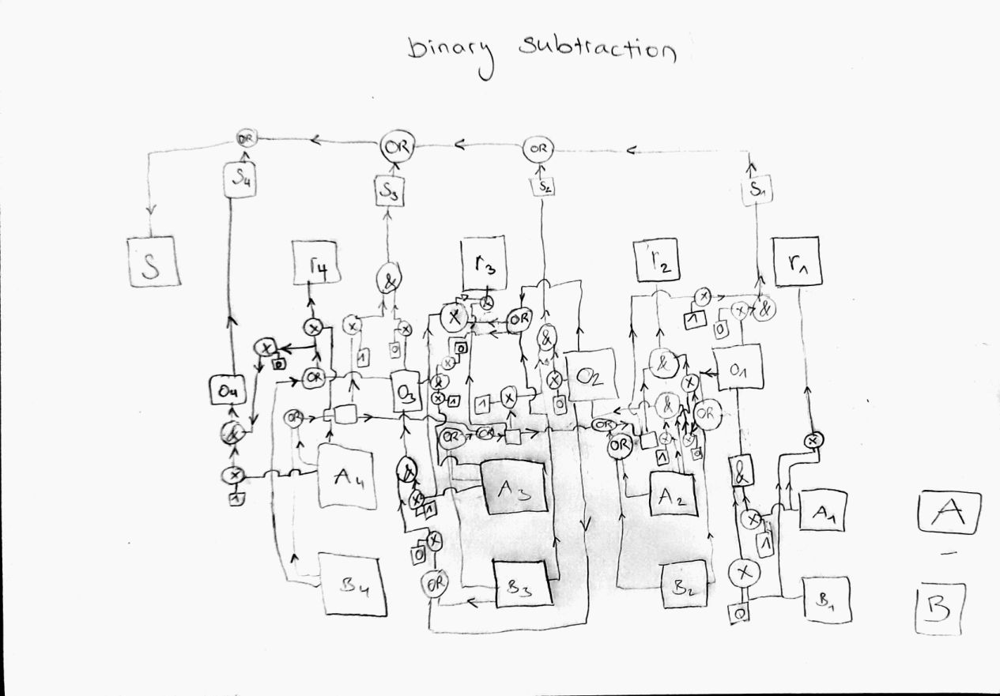

# Binary calculator
This project implements binary addition and subtraction using exclusively AND, OR and XOR gates. Find the calculator here: https://danielhoop.github.io/binary-calculator/

## Addition
The following figure shows the circuit. Input of gates are at bottom/right, the output is at the top/left.
* A = Figure 1 for addition
* B = Figure 2 for addition
* t = Temporary result from the addition of two digits
* o = Overflow from the addition of two digits
* r = Final result from the addition of digits (taking into account the previous overflow)

<table>
<tr><td></img></td></tr>
<tr><td>Circuit for binary addition</td></tr>
</table>

Not sure, if this is the optimal circuit, as I designed it myself and did never study this subject before. I heard somewhere that calculations can be designed by using AND, OR and XOR gates. So, I just tried it and it seems to work. :-)

## Subtraction
The following figure shows the circuit. The direction of the control flow is indicated. It is a hot mess, I admit! ^^
* A = Figure 1
* B = Figure 2 will be subtracted from A
* o = Overflow from the subtraction of two digits (or the previous ones)
* s = The sign indicating if the result is negative
* r = Final result from the subtraction of digits (taking into account the previous overflow)

<table>
<tr><td></img></td></tr>
<tr><td>Circuit for binary subtraction. It contains an error in the calculation of the overflow. In the code, this deviation is marked with "DEVIATION FROM CIRCUIT".</td></tr>
</table>

This one was quite hard to think through. Here as well, I did not consult any teaching material. I'm a little proud, I must admit... It really works!!! :-)