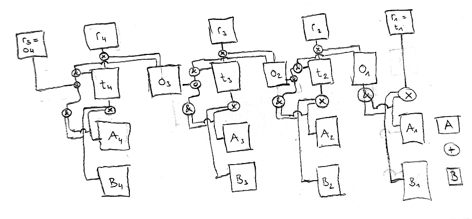

# Binary addition
This project implements a binary addition with AND, OR and XOR gates. Find the calculator here: https://danielhoop.github.io/binary-calculator/

The following figure shows the circuit. Input of gates are at bottom/right, the output is at the top/left.
* A = Figure 1 for addition
* B = Figure 2 for addition
* t = Temporary result from the addition of two digits
* o = Overflow from the addition of two digits
* r = Final result from the addition of digits (taking into account the previous overflow)

<table>
<tr><td></img></td></tr>
<tr><td>Circuit for binary addition</td></tr>
</table>

Not sure, if this is the optimal circuit, as I designed it myself and did never study this subject before. I heard somewhere that calculations can be designed by using AND, OR and XOR gates. So, I just tried it and it seems to work. :-)
